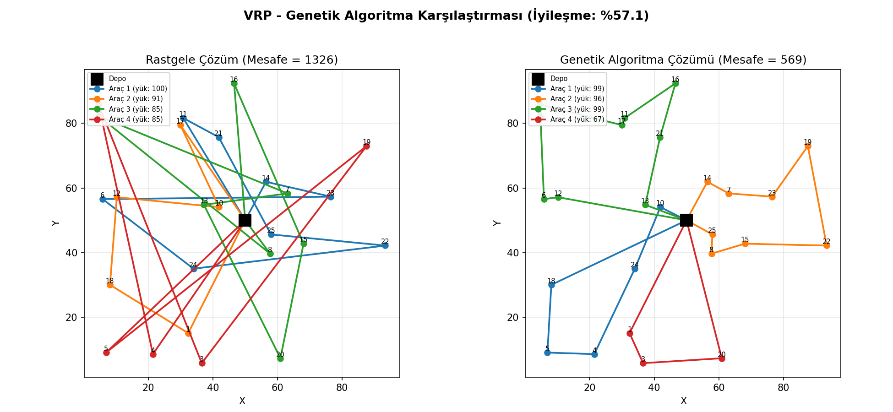
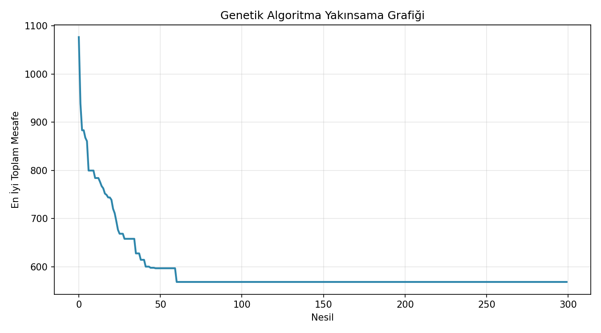

# vrp-genetik-algoritma

Genetik Algoritma ile Kapasiteli Araç Rotalama Problemi (CVRP) çözümü — lojistik ve dağıtım ağı optimizasyonu.

## Problem

Bir depodan, talepleri bilinen **n müşteriye**, kapasitesi sabit araçlarla dağıtım yapılacaktır:

- Her müşteri tam olarak **bir araç** tarafından, tam olarak **bir kez** ziyaret edilir.
- Her aracın rotası **depodan başlar, depoda biter**.
- Bir aracın taşıdığı toplam talep, **araç kapasitesini (Q)** aşamaz.
- **Amaç:** tüm araçların toplam kat ettiği mesafeyi minimize etmek.

Bu, **CVRP (Capacitated Vehicle Routing Problem)** olarak bilinen klasik bir lojistik optimizasyon problemidir ve **NP-hard**'dır — müşteri sayısı arttığında kesin (optimal) çözüm makul zamanda bulunamaz. Bu nedenle **Genetik Algoritma** gibi metasezgisel yöntemler kullanılır.

## Yöntem: Genetik Algoritma

**Kromozom kodlaması:** Müşterilerin bir permütasyonu ("dev tur"). Bu tur, kapasite sınırı aşılmadan art arda araçlara bölünerek gerçek rotalara dönüştürülür (*route splitting*).

**Genetik operatörler:**

| Operatör | Yöntem |
|---|---|
| Seçilim | Turnuva seçilimi (tournament selection) |
| Çaprazlama | Sıralı çaprazlama (Order Crossover — OX1) |
| Mutasyon | İki genin yer değiştirmesi (swap mutation) |
| Elitizm | En iyi bireyler doğrudan bir sonraki nesle taşınır |

## İçerik

| Dosya | Açıklama |
|---|---|
| `vrp_genetik_algoritma.py` | Problem tanımı, GA operatörleri, ana algoritma |
| `vrp_gorsel.py` | Rota haritası ve yakınsama (convergence) grafiği |
| `requirements.txt` | Gerekli Python paketleri |

## Kullanım

```bash
pip install -r requirements.txt

# Konsolda sonuçları görmek için
python vrp_genetik_algoritma.py

# Görselleri (PNG) üretmek için
python vrp_gorsel.py
```

## Örnek Sonuç

25 müşteri, araç kapasitesi 100 birim, 300 nesil:

```
Rastgele çözüm  -> Araç sayısı: 4  Toplam mesafe: 1326.3
GA Çözümü       -> Araç sayısı: 4  Toplam mesafe: 568.5
İyileşme: %57.1
```




## Genişletme Fikirleri

- **2-opt / Or-opt lokal arama:** GA sonucunu ince ayar yaparak daha da iyileştirmek (hibrit metasezgisel).
- **Zaman pencereleri (VRPTW):** Müşterilere teslim zaman aralığı ekleyerek problemi zenginleştirmek.
- **Gerçek yol ağı mesafeleri:** Öklid mesafesi yerine OSRM/Google Maps API ile gerçek sürüş mesafeleri.
- **Çok depolu VRP (MDVRP):** Tek depo yerine birden fazla dağıtım merkezi.
- **Simulated Annealing / Ant Colony ile karşılaştırma:** Farklı metasezgisellerin performans kıyaslaması.

## Kaynak

Dantzig, G.B., Ramser, J.H. (1959). *The Truck Dispatching Problem.* Management Science, 6(1), 80-91.
